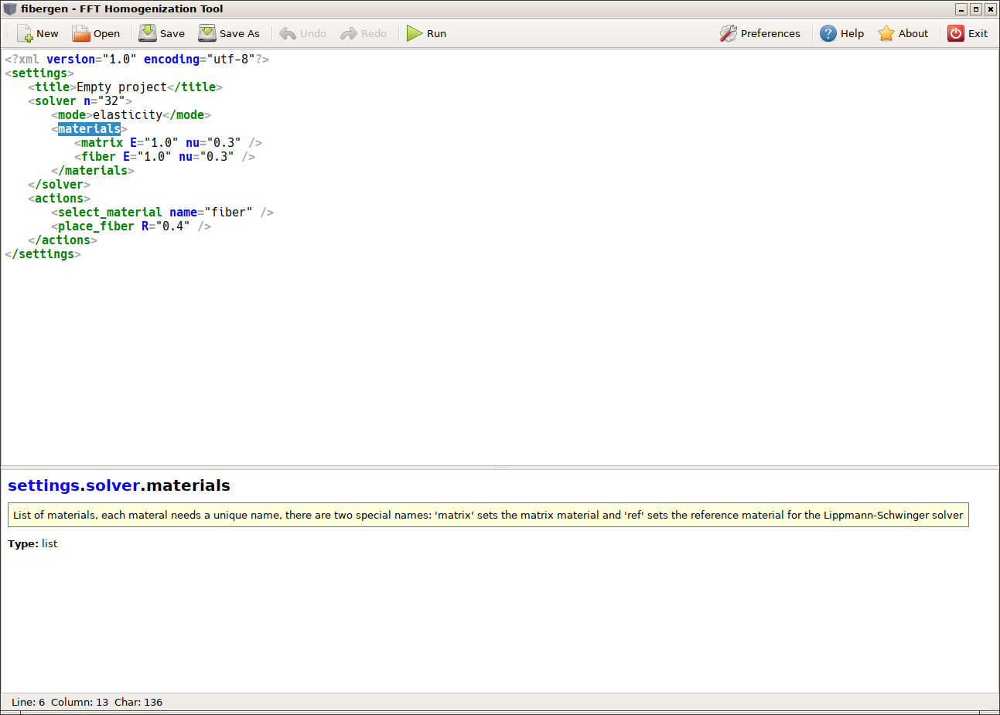
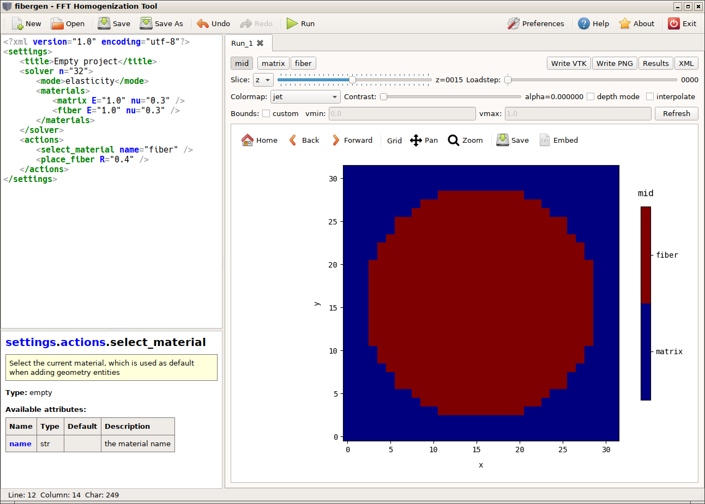
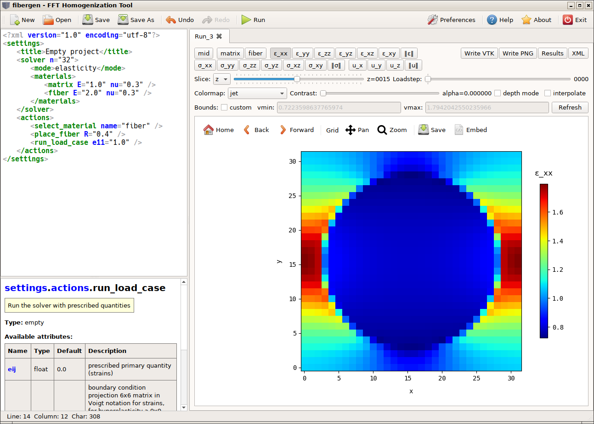
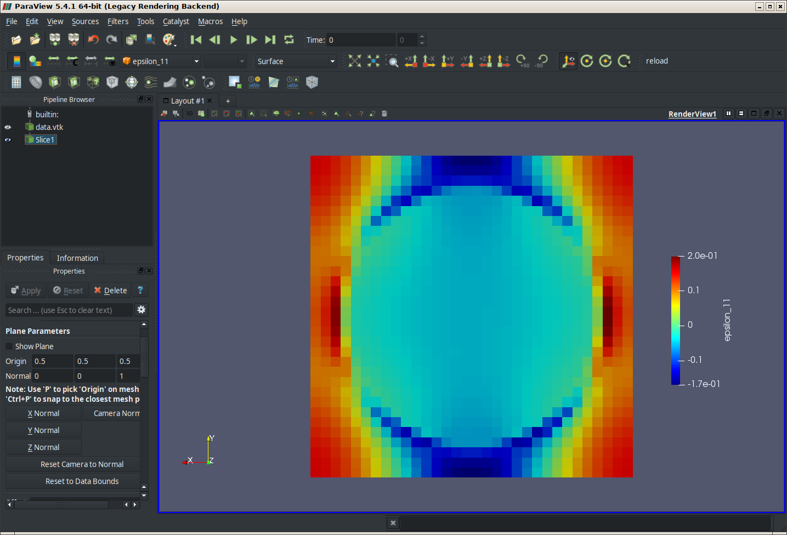

# fibergen Tutorial

## GUI

The GUI is opend using the shell command
```bash
fibergen-gui
```
After startup the GUI offers to create an "empty" project, to open one of the demos from the "demos" folder
or to open any other project using the "Open" menu. Alternatively the project filename to be opened can be appended to the command.


Creating an "empty" project shows the XML editor with the following contents
```xml
<?xml version="1.0" encoding="utf-8"?>
<settings>
	<title>Empty project</title>
	<solver n="32">
		<mode>elasticity</mode>
		<materials>
			<matrix E="1.0" nu="0.3" />
			<fiber E="1.0" nu="0.3" />
		</materials>
	</solver>
	<actions>
		<select_material name="fiber" />
		<place_fiber R="0.4" />
	</actions>
</settings>
```




The editor shows context help for the XML element at the cursor position in the bottom window.
There you also find a list all available settings in this context.

The "empty" project template actually creates a [0,1]³ representative volume element (RVE) discretized with 32 voxels in each direction.
Two linear isotropic materials are specified with a Young's modulus of 1.0 and a Poisson's ratio of 0.3.
Also we specify that we want to solve an "elasticity" problem.

In the actions section we then specify commands, which are run in sequence.
First we select the current material and then place a fiber with radius 0.4 into the RVE.
The default fiber type has spherical end caps and zero length and is placed by default in the center of the RVE.
You can see the available settings by moving the cursor on "place_fiber".

By clicking on "Run" in the menu bar the solver is run. In this case it just initializes and discretizes the geometry.



For each click on "Run" a new tab for the postprocessing view is opened. So it is possible to compared different runs.
(Note: you can rename the tabs by double-clicking on them).

In order to solve an elasticity problem you have to append to the actions
```xml
<run_load_case e11="1.0" />
```
which solves an homogenization problem with periodic boundary conditions and prescribed (average) elastic strain of 1.0 for the 11 (xx) component. In order to get interesting results you also have to set for example E="2.0" for the fiber material.



In the top row of each tab you can select the current solution view. "mid" means to show the material id. This is followed by a list of the phases (materials).
On the right are buttons to save the data as VTK file or to write the current view as PNG image.
The "Results" button switches to a view with a numerical summary of the solution. The "XML" button shows the XML project code that was used to produce the results.
You can close the Results/XML view by clicking again the button.

The second row of the postprocessing view is used to specify a 2d slice through the data for visualization in the bottom plot.
In the screenshot for example we slice at z=15 and the first loadcase (we have only one loadcase since this is a linear problem and we did not explicitly specify more loadcases). But in this case we can add an loadcase by appending another
```xml
<run_load_case e22="1.0" />
```

The third row let's us select a color map for visualization and the contrast (reduces visualization bounds in order to show more details by cutting off peaks). With checked "depth mode" and a selected phase in the first row, allows to have a depth view of the geometry by making phase values less than 1 transparent along the slicing direction. If "interpolation" is checked bi-cubic interpolation is used for visualization of the voxel data, otherwise nearest-neighbour interpolation.

The last row allows to set custom bounds (min./max.) for the visualization, wich is updated by clicking on "Refresh" afterwards.

The plot can be zoomed, etc. using the controls of the plot toolbar. The last command "Embed" allows to embed the current view within the xml file. So next time the project is loaded and run the same view will be restored.
When running projects within the GUI the view and settings from the current active tab will be used to initialize the view and settings of a new tab.

## Commandline Tool

The same project files created and saved with the GUI can be also run from the command line.
However, for postprocessing the result data needs to be saved to a file. I.e. continuing from the previous example we add
```xml
<write_vtk2 outfile="/tmp/data.vtk" />
```
in order to write the strain and stresses to a VTK file.
Please refer to the integraded GUI help for more output commands in the actions section ("write_*").
Given, the file was saved as "project.xml" in the current directory, we run
```bash
fibergen project.xml
```
to run the project and save the results. We can then postprocess the data using ParaView
```bash
paraview /tmp/data.vtk
```
and apply custom filters.




## XML code

The complete format for the XML project files is documented (and used by the GUI) in the file "doc/fileformat.xml".


## Python3 interface

In order to automate execution and modification of the XML project files (i.e. for a parameter study) an Python interface is provided.
The basic workflow is to create a (well-formed and working) project XML file "project.xml" (as above for example).
In order to run this file from Python you do
```python
import fibergen
fg = fibergen.FG()
fg.load_xml("project.xml")
fg.run()
```
If you want to modify a property before you call "fg.run()" you can do (for example changing the resolution)
```python
...
for res in [32, 64, 128]:
	fg.set("settings.solver..n", res)
	fg.run()
```
The ".." in "settings.solver..n" means to address an attribute of the element "settings.solver".
The resolution could be also set using
```python
fg.set("settings.solver..", nx=32, ny=64, nz=1)
```
In order to see the current (modified) project XML as string you can use
```python
print(fg.get_xml())
```
In order to obtain solution data use the "get_field" function.
Further documentation about the Python interface can be found by
```python
import fibergen
help(fibergen.FG)
```
which has roughly the following output
```python
class FG
   The fibergen solver class
   
   cancel(...)
       cancel( (FG)self) -> None :
           Cancel a running solver. This can be called in a callback routine for instance.
       
   erase(...)
       erase( (FG)self, (str)path) -> None :
           Remove a path from the XML tree
       
   get(...)
       get( (FG)self, (str)path) -> str :
           Get XML attribute or value of an element. Use get('element-path..attribute') to get an attribute value. If the emelent does not exists returns an empty string
       
   get_A2(...)
       get_A2( (FG)self) -> object :
           Get second order moment of fiber orientations
       
   get_A4(...)
       get_A4( (FG)self) -> object :
           Get fourth order moment of fiber orientations
       
   get_B_from_A(...)
       get_B_from_A( (FG)arg1, (float)arg2, (float)self, (float)A) -> object :
           Get angular central Gaussian covariance matrix from moment matrix
       
   get_distance_evals(...)
       get_distance_evals( (FG)self) -> int :
           Get number of distance evaluations for discretizing the geometry
       
   get_effective_property(...)
       get_effective_property( (FG)self) -> object :
           Get the effective property, computet by the action <calc_effective_properties>
       
   get_error(...)
       get_error( (FG)self) -> bool :
           Returns true, if there was an error running the solver
       
   get_field(...)
       object get_field(tuple args, dict kwds) :
           Returns solution data as numpy ndarray. Available solution fields are: 'epsilon' (strain), 'sigma' (stress), 'u' (displacement), 'p' (pressure), 'orientation' (fiber orientation vector), 'material_id' (material id), 'fiber_id' (id of the closest fiber), 'distance' (distance to closest interface), 'phi' (phases as listed in the <materials> section), any material name. The first dimension of the returned array denotes the component (3 for vectors, 6 (11,22,33,23,13,12) for symmetric 3x3 matrices, 9 (11,22,33,23,13,12,32,31,21) for 3x3 matrices), the last 3 dimensions address the spatial coordinates.
       
   get_mean_cauchy_stress(...)
       get_mean_cauchy_stress( (FG)self) -> object :
           Returns the mean Cauchy stress of the current solution
       
   get_mean_energy(...)
       get_mean_energy( (FG)self) -> float :
           Returns the mean energy of the current solution
       
   get_mean_strain(...)
       get_mean_strain( (FG)self) -> object :
           Returns the mean strain of the current solution
       
   get_mean_stress(...)
       get_mean_stress( (FG)self) -> object :
           Returns the mean stress of the current solution
       
   get_phase_names(...)
       get_phase_names( (FG)self) -> object :
           Return a list of the phase names (materials)
       
   get_real_volume_fraction(...)
       get_real_volume_fraction( (FG)self, (str)name) -> float :
           Get the volume fraction of a phase (material) using the exact geometry (including multiple overlaps)
       
   get_residuals(...)
       get_residuals( (FG)self) -> object :
           Get the residual for each iteration
       
   get_rve_dims(...)
       get_rve_dims( (FG)self) -> object :
           Get origin (first 3 components) and size of the RVE (last 3 components) as tuple
       
   get_solve_time(...)
       get_solve_time( (FG)self) -> float :
           Get the total runtime of the solver
       
   get_volume_fraction(...)
       get_volume_fraction( (FG)self, (str)name) -> float :
           Get the volume fraction of a phase (material) from the discretized geometry (voxels)
       
   get_xml(...)
       get_xml( (FG)self) -> str :
           Get the current project configuration as XML string
       
   get_xml_precision(...)
       get_xml_precision( (FG)self) -> int :
           Return the precision (number of digits) for representing floating point numbers as XML string attributes
       
   init(...)
       object init(tuple args, dict kwds) :
           Initialize the object with a Python fibergen reference to it self, which can be used (in Python scripts) within a project file as 'fg'. If not called 'fg' will not be available. This step is necessary to expose the correctly wrapped Python object to C++, e.g. fg = fibergen.FG(); fg.init(fg)
       
   init_fibers(...)
       init_fibers( (FG)self) -> None :
           Generate the random geometry (this is usually done automatically)
       
   init_lss(...)
       init_lss( (FG)self) -> None :
           Initialize the Lippmann-Schwinger solver (this is usually done automatically)
       
   init_phase(...)
       init_phase( (FG)self) -> None :
           Discretize the geometry (this is usually done automatically)
       
   load_xml(...)
       load_xml( (FG)self, (str)filename) -> None :
           Load a project from a XML file
       
   reset(...)
       reset( (FG)self) -> None :
           Resets the solver to its initial state and unloads any loaded XML file.
       
   run(...)
       run( (FG)self) -> int :
           Runs the solver (i.e. the actions in the <actions> section)
       
       run( (FG)self, (str)path) -> int :
           Run actions from a specified path in the XML tree
       
   set(...)
       set( (FG)self, (str)path, (str)value) -> None :
           Set XML attribute or value of an element. Use set('element-path..attribute', value) to set an attribute value.
       
       set( (FG)self, (str)path, (float)value) -> None :
           Set a floating point property
       
       set( (FG)self, (str)path, (int)value) -> None :
           Set an integer property
       
       set( (FG)self, (str)path) -> None :
           Set a property to an empty value
       
       object set(tuple args, dict kwds) :
           Set a property in the XML tree using a path and multiple arguments or keyword arguments, i.e. set('path', x=1, y=2, z=0) is equivalent to set('path.x', 1), set('path.y', 2), set('path.z', 0)
       
   set_convergence_callback(...)
       set_convergence_callback( (FG)self, (object)func) -> None :
           Set a callback function to be called each iteration of the solver. If the callback returns True, the solver is canceled.
       
   set_loadstep_callback(...)
       set_loadstep_callback( (FG)self, (object)func) -> None :
           Set a callback function to be called each loadstep of the solver. If the callback returns True, the solver is canceled.
       
   set_log_file(...)
       set_log_file( (FG)self, (str)filename) -> None :
           Set filename for capturing the console output
       
   set_py_enabled(...)
       set_py_enabled( (FG)arg1, (bool)self) -> None :
           Enable/Disable Python evaluation of XML attributes as Python expressions requested by the solver
       
   set_variable(...)
       set_variable( (FG)self, (str)name, (object)value) -> None :
           Set a Python variable, which can be later used in XML attributes as Python expressions
       
   set_xml(...)
       set_xml( (FG)arg1, (str)self) -> None :
           Load the current project configuration from a XML string
       
   set_xml_precision(...)
       set_xml_precision( (FG)self, (int)digits) -> None :
           Set the precision (number of digits) for representing floating point numbers as XML string attributes
```
